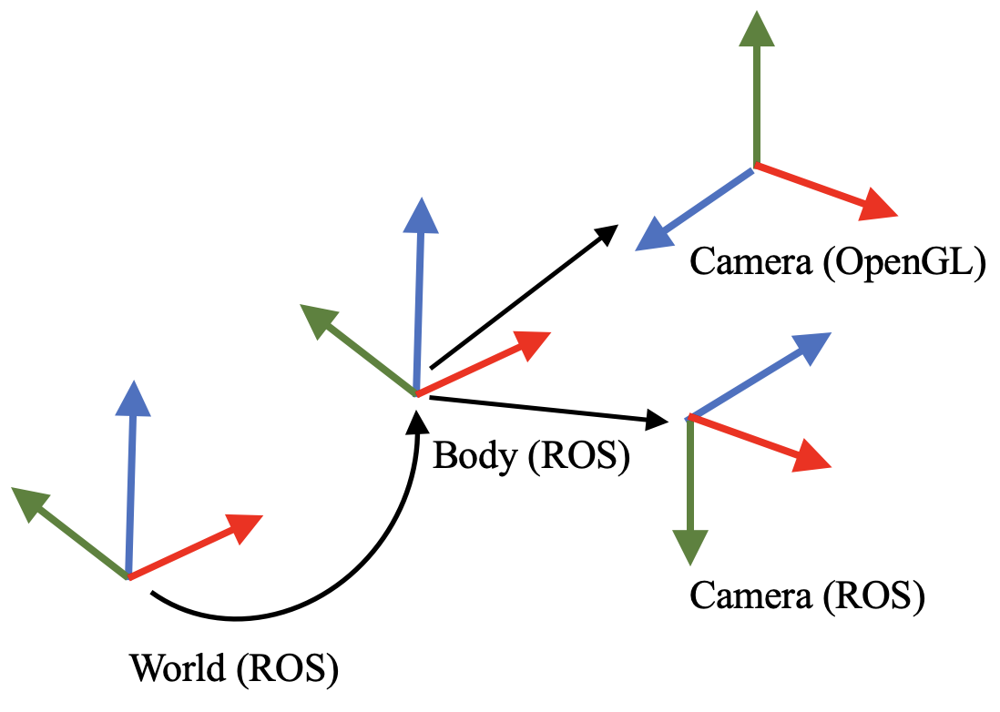

# cloudrender: an OpenGL framework for pointcloud and mesh rendering
A visualization framework capable of rendering large pointclouds, dynamic SMPL models and more. Used to visualize results in our Human POSEitioning System (HPS) project: http://virtualhumans.mpi-inf.mpg.de/hps/

## Requirements
- GPU with OpenGL 4.0 

Optionally, if you want to run included test script:
- EGL support (for headless rendering)
- ffmpeg>=2.1 with libx264 enabled and ffprobe installed (for saving to video)

## Installation
#### Step 1. Get the code
Copy the code without installation
```bash
git clone https://github.com/vguzov/cloudrender
pip install -r requirements.txt
pip install git+https://github.com/mattloper/chumpy
```
or install as a package with
```
pip install cloudrender
```
#### Step 2. Get the SMPL model
- Follow install instructions at https://github.com/gulvarol/smplpytorch
- Make sure to fix the typo for male model while unpacking SMPL .pkl files: `basicmodel_m_lbs_10_207_0_v1.0.0.pkl -> basicModel_m_lbs_10_207_0_v1.0.0.pkl`

## Running test script
### test_scene_video.py
Run `download_test_assets.sh` – it will create `test_assets` folder and download everything you need for sample to work
(3D scan pointcloud, human shape and motion files, camera trajectory file)

Run `test_scene_video.py`

The following script will write a short video inside `test_assets/output.mp4` which should look similar to this:
<p align="center">

</p>

## Note to the given camera_trajectory
The definition of the camera frame (x: right, y: up, z: backward) is different from that in ROS (x: right, y: down, z: forward). For convenience, please provide the pose in the world as the body frame definition (x: forward, y: left, z: up), and then do right multipulation:
```
T^world_cam = T^world_body * T_offset
```
where
```
T_offset = [quat2rotm([0.5000,0.5000, -0.500, -0.5000]), [0, 0, 0]'; 0 0 0 1]
```
quaternion is defined as [w, x, y, z]

<p align="center">

</p>

## More data
Please check our HPS project page for more 3D scans and motion data: http://virtualhumans.mpi-inf.mpg.de/hps/

## Citation

If you find the code or data useful, please cite: 

```
@inproceedings{HPS,
    title = {Human POSEitioning System (HPS): 3D Human Pose Estimation and Self-localization in Large Scenes from Body-Mounted Sensors },
    author = {Guzov, Vladimir and Mir, Aymen and Sattler, Torsten and Pons-Moll, Gerard},
    booktitle = {{IEEE} Conference on Computer Vision and Pattern Recognition (CVPR)},
    month = {jun},
    organization = {{IEEE}},
    year = {2021},
}
```
